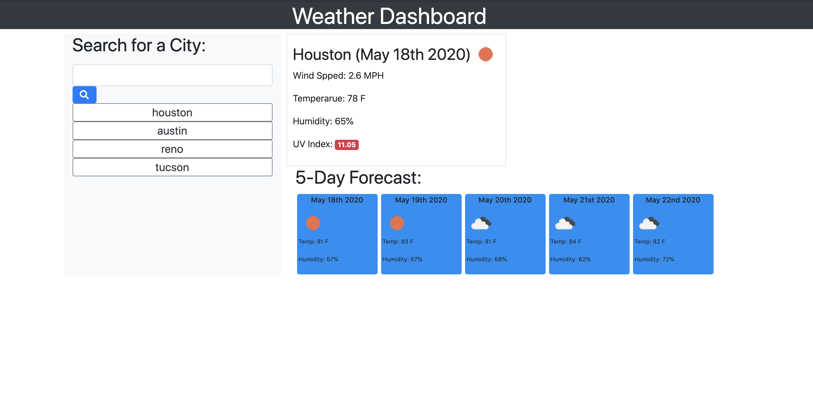

# weather_dashboard

This dashboard is a demonstration of my ability to use back end development and merge it with front end. Moreover, it will include API calls passing information to fuctions, scoping and JQUERY. 

Below is a screen shot of the app. 

Link to application: 

https://truittj.github.io/weather_dashboard/